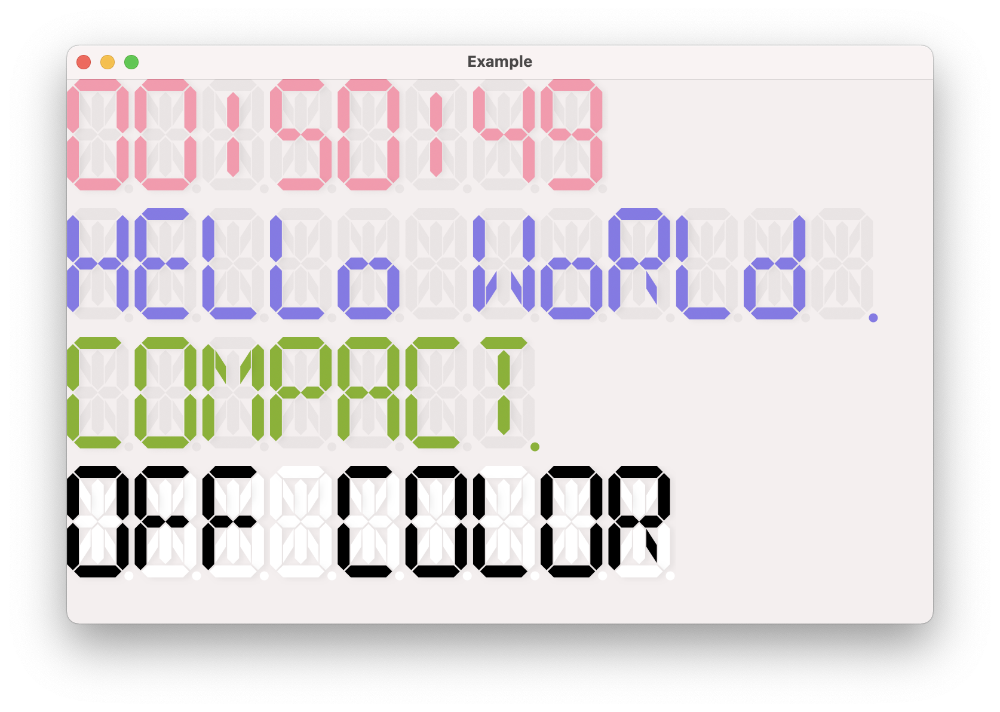

# LEDTextLabel
LEDTextLabel for macOS

### How to use
Just copy everything under `LEDTextLabel` to your project or use `LEDTextLabel.xcodeproj` as a subproject in your Xcode workspace and link the `libLEDTextLabel.dylib`.

### Example
See `Example/ViewController.m` for some examples.
